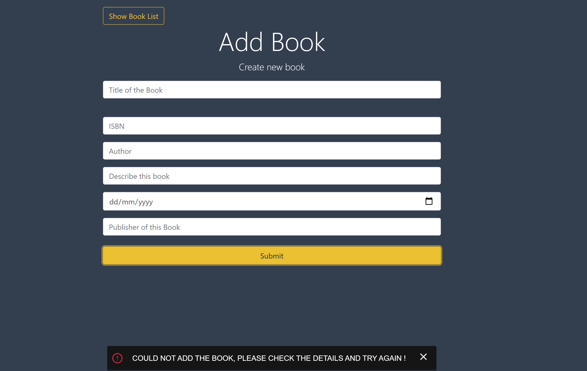

# Books
***A simple book app where you can create/add new book, update/delete existing book and view the book details.***

## Instructions
##### 1. Clone ***( using `git clone` )*** or Download the folder ***( using ***`Download ZIP`*** option )*** #####
##### 2. Open your code editor and add the project folder #####
##### 3. Open the terminal and install all required dependencies with ***`npm i`*** #####
##### 4. Add a new terminal and navigate one to the server and one to the client using ***`cd command`*** #####
##### 5. type ***`npm start`*** both in server and client terminals to start the app #####

 ###### 📚 *Enjoy using the app !!* 📚 ######

